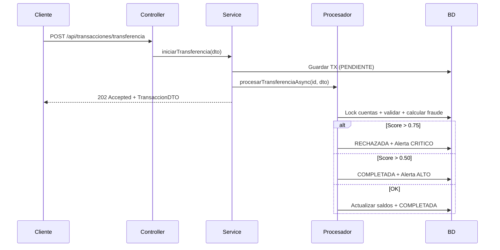

# Sistema de Procesamiento de Transacciones Financieras

Backend REST desarrollado con **Spring Boot 3** para procesar transferencias bancarias de forma **asíncrona y concurrente**, con detección de fraude en tiempo real, gestión de alertas y métricas estadísticas por cuenta.

---

## Tabla de contenidos

- [Descripción general](#descripción-general)
- [Características principales](#características-principales)
- [Stack tecnológico](#stack-tecnológico)
- [Arquitectura](#arquitectura)
- [Estructura del proyecto](#estructura-del-proyecto)
- [Requisitos previos](#requisitos-previos)
- [Instalación y ejecución](#instalación-y-ejecución)
- [Configuración](#configuración)
- [Base de datos y datos de ejemplo](#base-de-datos-y-datos-de-ejemplo)
- [API REST](#api-rest)
- [Motor de detección de fraude](#motor-de-detección-de-fraude)
- [Procesamiento asíncrono y concurrencia](#procesamiento-asíncrono-y-concurrencia)
- [Logging y trazabilidad](#logging-y-trazabilidad)
- [Manejo de errores](#manejo-de-errores)
- [Pruebas y cobertura](#pruebas-y-cobertura)
- [Ejemplos con cURL](#ejemplos-con-curl)
- [Limitaciones conocidas](#limitaciones-conocidas)

---

## Descripción general

Este sistema simula el núcleo operativo de un banco digital. Expone una API HTTP que permite:

- Iniciar **transferencias individuales** con respuesta inmediata (`202 Accepted`) mientras el procesamiento continúa en segundo plano.
- Procesar **lotes masivos** de hasta 500 transferencias en paralelo.
- Consultar el **estado** de una transacción en cualquier momento.
- Obtener **resúmenes estadísticos** de cuentas (promedio de montos, desviación estándar, riesgo acumulado).
- Gestionar **alertas de fraude** pendientes de revisión.

La persistencia utiliza **H2 en memoria** con datos precargados al arrancar, lo que facilita el desarrollo y las pruebas sin dependencias externas.

---

## Características principales

| Área | Detalle |
|------|---------|
| **Transferencias** | Validación IBAN, cuentas distintas, montos positivos (máx. 50 000 €) |
| **Fraude** | Score ponderado (0.0–1.0) con rechazo automático si supera 0.75 |
| **Concurrencia** | Bloqueo pesimista en cuentas, orden determinista de locks para reducir deadlocks |
| **Lotes** | Fragmentación en sublotes de 50, procesamiento paralelo con `CompletableFuture` |
| **Alertas** | Paginación, orden por nivel de riesgo, revisión manual con notificación asíncrona |
| **Métricas** | Desviación estándar, puntuación de riesgo acumulada, ranking por `CuentaRiesgoComparator` |
| **Trazabilidad** | `correlationId` en MDC propagado a hilos asíncronos |

---

## Stack tecnológico

| Tecnología | Versión / Uso |
|------------|---------------|
| Java | 21 |
| Spring Boot | 3.2.5 |
| Spring Web | REST API |
| Spring Data JPA | Persistencia |
| Spring Validation | Validación de DTOs |
| H2 Database | Base de datos en memoria |
| Lombok | Reducción de boilerplate |
| MapStruct | Mapeo entidad ↔ DTO |
| JUnit 5 + MockMvc | Pruebas unitarias e integración |
| JaCoCo | Informe de cobertura (`mvn verify`) |
| Maven | Gestión de dependencias y build |

---

## Arquitectura

El proyecto sigue una arquitectura en capas clásica de Spring:

```
┌─────────────────────────────────────────────────────────┐
│  Controllers  (Transaccion, Cuenta, Fraude)               │
├─────────────────────────────────────────────────────────┤
│  Services     (TransaccionService, CuentaService,       │
│                FraudeService, TransaccionProcesador)      │
├─────────────────────────────────────────────────────────┤
│  Repositories (JPA)                                       │
├─────────────────────────────────────────────────────────┤
│  Domain       (Cliente, Cuenta, Transaccion, AlertaFraude)│
└─────────────────────────────────────────────────────────┘
         ▲                              ▲
         │                              │
    DTOs / Mappers              Utilidades (FraudeScoreCalculator,
                                CicloTransaccionDetector, CuentaRiesgoComparator)
```

### Flujo de una transferencia individual



---

## Estructura del proyecto

```
src/
├── main/
│   ├── java/com/banco/transacciones/
│   │   ├── Application.java              # Punto de entrada
│   │   ├── config/                       # Async, AppConfig, MDC
│   │   ├── controller/                   # REST endpoints
│   │   ├── domain/
│   │   │   ├── enums/                    # Estados, tipos, niveles de riesgo
│   │   │   └── models/                   # Entidades JPA
│   │   ├── dto/
│   │   │   ├── request/                  # TransferenciaDTO + validaciones
│   │   │   ├── response/                 # DTOs de salida
│   │   │   └── validation/               # Validadores personalizados
│   │   ├── exception/                    # Excepciones + GlobalExceptionHandler
│   │   ├── mapper/                       # MapStruct mappers
│   │   ├── repository/                   # Spring Data JPA
│   │   ├── service/                      # Lógica de negocio
│   │   └── util/                         # Calculadores y algoritmos
│   └── resources/
│       ├── application.properties        # Configuración principal
│       └── data.sql                      # Datos iniciales
└── test/
    └── java/com/banco/transacciones/     # Tests unitarios e integración
```

---

## Requisitos previos

- **JDK 21** o superior
- **Maven 3.8+** (opcional si se usa el wrapper incluido: `mvnw` / `mvnw.cmd`)
- Puerto **8080** disponible

---

## Instalación y ejecución

### 1. Clonar el repositorio

```bash
git clone <url-del-repositorio>
cd Sistema-de-Procesamiento-de-Transacciones-Financieras
```

### 2. Compilar el proyecto

```bash
# Windows
.\mvnw.cmd clean package

# Linux / macOS
./mvnw clean package
```

### 3. Ejecutar la aplicación

```bash
# Windows
.\mvnw.cmd spring-boot:run

# Linux / macOS
./mvnw spring-boot:run
```

La API quedará disponible en: **http://localhost:8080**

### 4. Consola H2 (opcional)

Durante el desarrollo puedes inspeccionar la base de datos en:

- **URL:** http://localhost:8080/h2-console
- **JDBC URL:** `jdbc:h2:mem:transaccionesdb`
- **Usuario:** `sa`
- **Contraseña:** *(vacía)*

> La base de datos es **en memoria**: los datos se reinician al detener la aplicación.

---

## Configuración

Archivo principal: `src/main/resources/application.properties`

| Propiedad | Valor por defecto | Descripción |
|-----------|-------------------|-------------|
| `server.port` | `8080` | Puerto del servidor |
| `spring.datasource.url` | `jdbc:h2:mem:transaccionesdb` | URL JDBC H2 |
| `spring.jpa.hibernate.ddl-auto` | `create-drop` | Recrea esquema en cada arranque |
| `spring.jpa.defer-datasource-initialization` | `true` | Ejecuta `data.sql` tras crear tablas |
| `fraude.reglas.umbral.monto` | `10000.00` | Monto a partir del cual suma peso de fraude |
| `fraude.reglas.peso.monto` | `0.30` | Peso por monto elevado |
| `fraude.reglas.peso.hora` | `0.20` | Peso por horario inusual (00:00–05:00) |
| `fraude.reglas.peso.frecuencia` | `0.25` | Peso por alta frecuencia (>3 TX en 5 min) |
| `fraude.reglas.peso.antiguedad` | `0.15` | Peso por cuenta destino reciente (<7 días) |
| `fraude.reglas.peso.pais` | `0.10` | Peso por país destino inusual |
| `logging.level.com.banco.transacciones` | `DEBUG` | Nivel de log del paquete principal |

Perfil de pruebas: `application-test.properties` (activado con `@ActiveProfiles("test")`).

---

## Base de datos y datos de ejemplo

Al iniciar, `data.sql` carga:

### Clientes

| ID | Nombre | DNI |
|----|--------|-----|
| 1 | Juan Perez | 12345678A |
| 2 | Maria Gomez | 87654321B |
| 3 | Empresa Logística S.L. | B12345678 |

### Cuentas de prueba

| Número de cuenta | Saldo | Tipo | Estado | Cliente |
|------------------|-------|------|--------|---------|
| `ES9121000418401234567890` | 15 000 € | CORRIENTE | ACTIVADA | Juan Perez |
| `ES9121000418401111111111` | 10 000 € | ACTIVO | **BLOQUEADA** | Maria Gomez |
| `ES9121000418400987654321` | 1 000 € | CORRIENTE | ACTIVADA | Maria Gomez |
| `ES9121000418402222222222` | 2 000 € | CORRIENTE | ACTIVADA | Empresa Logística |
| `ES9121000418403333333333` | 50 000 € | EMPRESARIAL | ACTIVADA | Empresa Logística |
| `ES9121000418404444444444` | 5 000 € | EMPRESARIAL | ACTIVADA | Empresa Logística |

También incluye transacciones históricas y alertas de fraude precargadas para pruebas manuales.

---

## API REST

Base URL: `http://localhost:8080`

### Transacciones — `/api/transacciones`

#### `POST /transferencia`

Inicia una transferencia individual. Respuesta **202 Accepted** (procesamiento asíncrono).

**Request body:**

```json
{
  "cuentaOrigen": "ES9121000418401234567890",
  "cuentaDestino": "ES9121000418400987654321",
  "monto": 150.00,
  "codigoPais": "ES",
  "descripcion": "Pago de servicios"
}
```

**Validaciones:**

- IBAN con formato `[A-Z]{2}[0-9]{2}[A-Z0-9]{10,30}`
- Cuenta origen ≠ cuenta destino
- Monto > 0 y ≤ 50 000.00
- Código de país ISO de 2 letras

**Response (202):**

```json
{
  "id": 1001,
  "cuentaOrigen": "ES9121000418401234567890",
  "cuentaDestino": "ES9121000418400987654321",
  "monto": 150.00,
  "tipo": "TRANSFERENCIA",
  "estado": "PENDIENTE",
  "hora": "2026-06-16T10:30:00Z",
  "descripcion": null
}
```

---

#### `GET /{id}/estado`

Consulta el estado actual de una transacción. Respuesta **200 OK** o **404 Not Found**.

**Estados posibles:** `PENDIENTE`, `PROCESANDO`, `COMPLETADA`, `RECHAZADA`, `REVERTIDA`

---

#### `POST /lote`

Procesa un lote de transferencias en paralelo. Respuesta **202 Accepted**.

- Mínimo: 1 transferencia
- Máximo: **500** transferencias por lote
- Sublotes internos de 50 elementos

**Response (202):**

```json
{
  "totalRecibidas": 2,
  "totalExitosas": 2,
  "totalFallidas": 0,
  "detallesRechazo": []
}
```

---

### Cuentas — `/api/cuentas`

#### `GET /{numeroCuenta}/resumen`

Retorna métricas estadísticas de una cuenta. Respuesta **200 OK** o **404 Not Found**.

**Response (200):**

```json
{
  "numeroCuenta": "ES9121000418401234567890",
  "saldoActual": 15000.00,
  "totalMovimientos": 2,
  "montoPromedio": 7550.00,
  "desviacionEstandar": 7450.00,
  "puntuacionRiesgoAcumulada": 0.75,
  "alertasCriticas": 0,
  "fechaAlta": "2026-06-16"
}
```

---

### Fraude — `/api/fraude`

#### `GET /alertas`

Lista alertas **no revisadas** con paginación. Respuesta **200 OK**.

**Parámetros de paginación (opcionales):**

| Parámetro | Default | Descripción |
|-----------|---------|-------------|
| `page` | `0` | Número de página |
| `size` | `20` | Tamaño de página |
| `sort` | `nivel,id` DESC | Orden por nivel de riesgo y fecha |

**Response (200):**

```json
{
  "content": [
    {
      "id": 102,
      "transaccionId": 312,
      "nivel": "ALTO",
      "motivo": "Múltiples transferencias en 5 min (>3)",
      "revisada": false,
      "fechaCreacion": null
    }
  ],
  "totalElements": 1,
  "totalPages": 1,
  "size": 20,
  "number": 0
}
```

---

#### `PUT /alertas/{id}/revisar`

Marca una alerta como revisada. Respuesta **204 No Content**.

Si la alerta es de nivel **CRITICO**, se dispara una notificación asíncrona.

---

## Motor de detección de fraude

El componente `FraudeScoreCalculator` calcula un score entre **0.0** y **1.0** sumando pesos configurables:

| Regla | Condición | Peso default |
|-------|-----------|--------------|
| Monto elevado | Monto > 10 000 € | +0.30 |
| Horario inusual | Entre 00:00 y 05:00 | +0.20 |
| Alta frecuencia | > 3 TX de la misma cuenta en 5 min | +0.25 |
| Cuenta reciente | Cliente destino con alta < 7 días | +0.15 |
| País inusual | Código distinto al historial o residencia | +0.10 |

### Acciones según score

| Rango | Acción |
|-------|--------|
| **> 0.75** | Transacción **RECHAZADA** + alerta **CRITICO** |
| **> 0.50** | Transacción **COMPLETADA** + alerta **ALTO** |
| **≤ 0.50** | Transacción **COMPLETADA** sin alerta |

### Utilidades adicionales

- **`CicloTransaccionDetector`**: detecta ciclos en grafos de transferencias (DFS iterativo, O(V+E)).
- **`CuentaRiesgoComparator`**: ordena cuentas por riesgo acumulado, alertas críticas y antigüedad.

---

## Procesamiento asíncrono y concurrencia

### Pool de hilos

Configurado en `AsyncConfig` con el bean `transaccionExecutor`:

- **Core pool size:** número de procesadores disponibles
- **Max pool size:** procesadores × 2
- **Queue capacity:** 200
- **Política de rechazo:** `CallerRunsPolicy`
- **Propagación MDC:** `MdcTaskDecorator` mantiene el `correlationId` en hilos hijos

### Bloqueo de cuentas

Las transferencias adquieren **bloqueo pesimista** (`PESSIMISTIC_WRITE`) sobre las cuentas involucradas. El orden de bloqueo se determina alfabéticamente por número de cuenta para minimizar interbloqueos (deadlocks).

### Reglas de negocio en procesamiento

1. Cuenta origen debe estar en estado `ACTIVADA`
2. Saldo suficiente en cuenta origen
3. Cálculo de score de fraude
4. Movimiento de saldos (débito origen / crédito destino)

---

## Logging y trazabilidad

Cada petición HTTP recibe un **`correlationId`** único (UUID) mediante `MdcFilter`, incluido en todos los logs:

```
2026-06-16 10:30:00 [http-nio-8080-exec-1] INFO  c.b.t.service.impl.TransaccionServiceImpl - [a1b2c3d4-...] Entrada: Iniciando transferencia...
```

El identificador se propaga a operaciones `@Async` gracias al decorador de tareas MDC.

---

## Manejo de errores

Todas las excepciones se transforman en respuestas JSON estandarizadas (`ErrorResponse`):

```json
{
  "timestamp": "2026-06-16T10:30:00Z",
  "status": 404,
  "error": "Recurso no encontrado",
  "detalle": "Transacción con ID 999 no encontrada",
  "path": "/api/transacciones/999/estado"
}
```

| Código HTTP | Situación |
|-------------|-----------|
| **400** | Validación fallida, saldo insuficiente |
| **403** | Cuenta bloqueada o inactiva |
| **404** | Recurso no encontrado (cuenta, transacción, alerta) |
| **409** | Conflicto de concurrencia |
| **500** | Error interno no controlado |

---

## Pruebas y cobertura

### Ejecutar todas las pruebas

```bash
# Windows
.\mvnw.cmd test

# Linux / macOS
./mvnw test
```

### Generar informe JaCoCo

```bash
.\mvnw.cmd verify
```

El informe HTML se genera en: `target/site/jacoco/index.html`

### Tipos de pruebas incluidas

| Tipo | Ejemplos |
|------|----------|
| **Unitarias** | `FraudeScoreCalculatorTest`, `CuentaServiceImplTest`, `TransaccionServiceImplTest` |
| **Integración** | `TransaccionIntegrationTest`, `FraudeIntegrationTest`, `CuentaIntregationTest` |
| **Validación** | `CuentasDistintasValidatorTest` |
| **Excepciones** | `GlobalExceptionHandlerTest` |

---

## Ejemplos con cURL

### Transferencia individual

```bash
curl -X POST http://localhost:8080/api/transacciones/transferencia \
  -H "Content-Type: application/json" \
  -d '{
    "cuentaOrigen": "ES9121000418401234567890",
    "cuentaDestino": "ES9121000418400987654321",
    "monto": 100.00,
    "codigoPais": "ES",
    "descripcion": "Pago de prueba"
  }'
```

### Consultar estado

```bash
curl http://localhost:8080/api/transacciones/1001/estado
```

### Resumen de cuenta

```bash
curl http://localhost:8080/api/cuentas/ES9121000418401234567890/resumen
```

### Listar alertas pendientes

```bash
curl "http://localhost:8080/api/fraude/alertas?page=0&size=10"
```

### Revisar alerta

```bash
curl -X PUT http://localhost:8080/api/fraude/alertas/102/revisar
```

### Lote de transferencias

```bash
curl -X POST http://localhost:8080/api/transacciones/lote \
  -H "Content-Type: application/json" \
  -d '[
    {
      "cuentaOrigen": "ES9121000418401234567890",
      "cuentaDestino": "ES9121000418400987654321",
      "monto": 50.00,
      "codigoPais": "ES"
    },
    {
      "cuentaOrigen": "ES9121000418403333333333",
      "cuentaDestino": "ES9121000418404444444444",
      "monto": 200.00,
      "codigoPais": "ES"
    }
  ]'
```

---

## Limitaciones conocidas

- La base de datos **H2 en memoria** no persiste datos entre reinicios; no está pensada para producción.
- Las transferencias individuales retornan **202** incluso si el procesamiento asíncrono falla después (consultar estado vía `GET /{id}/estado`).
- No hay autenticación ni autorización implementada en la API.
- El motor de fraude es **heurístico** y configurable; no sustituye un sistema antifraude real.
- `CicloTransaccionDetector` y `CuentaRiesgoComparator` están implementados como utilidades pero **no se exponen** actualmente vía endpoints REST.

---

## Licencia

Este proyecto no incluye un archivo de licencia explícito. Consulta al autor o mantenedor del repositorio para condiciones de uso.
